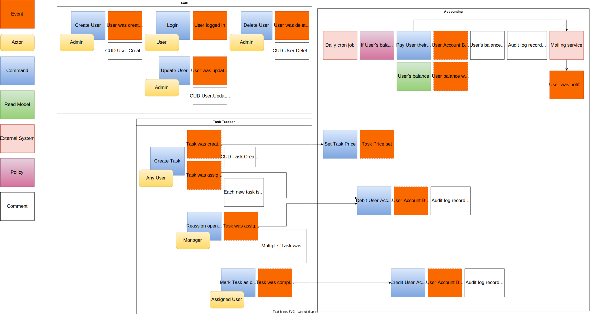
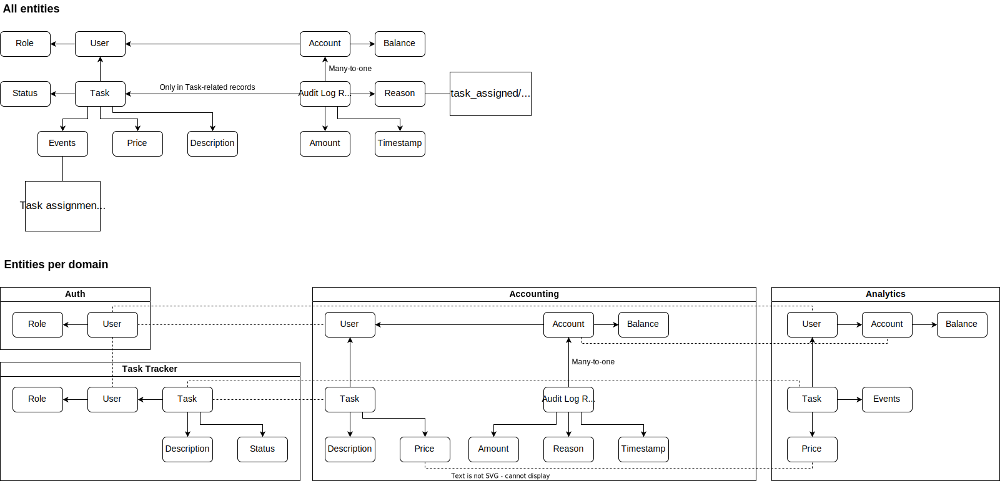
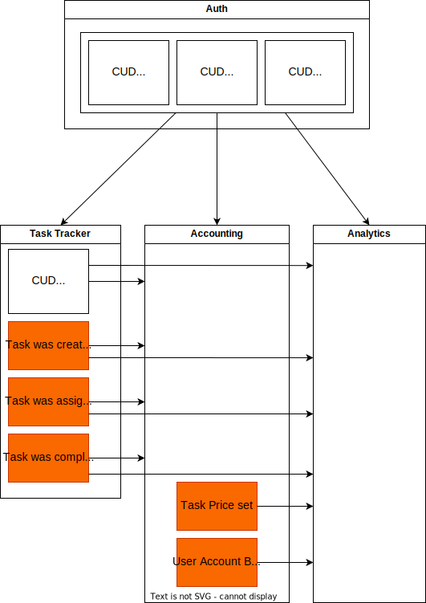

# Awesome Task Exchange System

## Event Storming

## Data Model

## Services

* Auth - User authentication and management;
* Task Tracker;
* Accounting;
* Analytics.

## Service Communications

There is no need to use synchronous communications between the services.
All communications will be done using asynchronously processed messages for
business and CUD events.

### Events

All events must include a `timestamp` field indicating the time of event's
occurrence.

#### Auth

##### User.Created/Updated/Deleted

CUD events emitted for operations on User entity.
They are used to update other services' local User repositories.

Data:

* `user_id` - public ID of the User;
* `email` - email of the User;
* `role` - role of the User.

Consumed by:

* Task Tracker;
* Accounting;
* Analytics.

#### Task Tracker

##### Task.Created

CUD event emitted for each new Task.
It is used to update other services' local Task repositories.

Data:

* `task_id` - public ID of the Task;
* `description` - task description.

Consumed by:

* Accounting;
* Analytics.

##### Task was created

Business event emitted by `Create Task` command.

Data:

* `task_id` - public ID of the Task.

Consumed by:

* Accounting - triggers `Set Task price` command.

##### Task was assigned

Business event emitted by `Create Task` and `Reassign open Tasks` commands.
`Reassign open Tasks` emits multiple event instances - one for each reassigned
Task.

Data:

* `task_id` - public ID of the Task;
* `assigned_to` - public ID of the User to which the Task was assigned.

Consumed by:

* Accounting - triggers `Debit User for Task assignment` command;
* Analytics.

##### Task was completed

Business event emitted by `Mark Task as completed` command.

Data:

* `task_id` - public ID of the Task;
* `assigned_to` - public ID of the User to which the Task was assigned
  at the moment of being completed.

Consumed by:

* Accounting - triggers `Credit User for Task completion` command;
* Analytics.

#### Accounting

##### Task Price set

CUD event emitted for each new AuditLogRecord.
It is mainly used for analytical data processing.

Data:

* `task_id` - public ID of the Task;
* `assignment_price` - amount of money debited from User account
  for task assignment;
* `completion_price` - amount of money credited to User account
  for task completion.

Consumed by:

* Analytics.

##### User Account Balance changed

Business event emitted for each operation changing User Account balance.

Data:

* `user_id` - public ID of the User;
* `balance` - User Account balance after the change.

Consumed by:

* Analytics.
