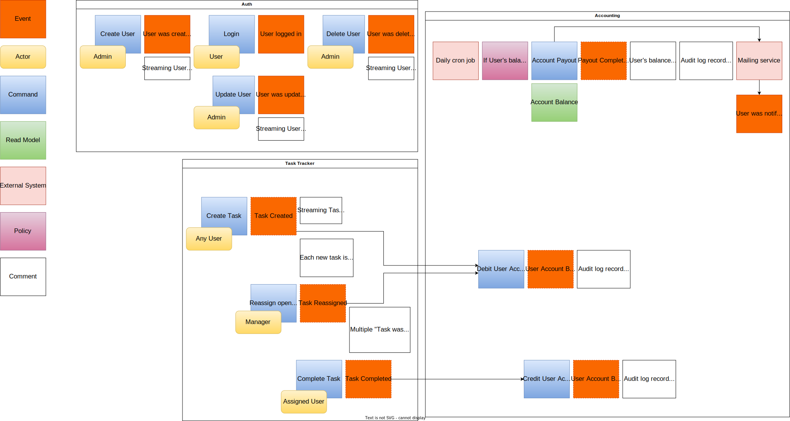
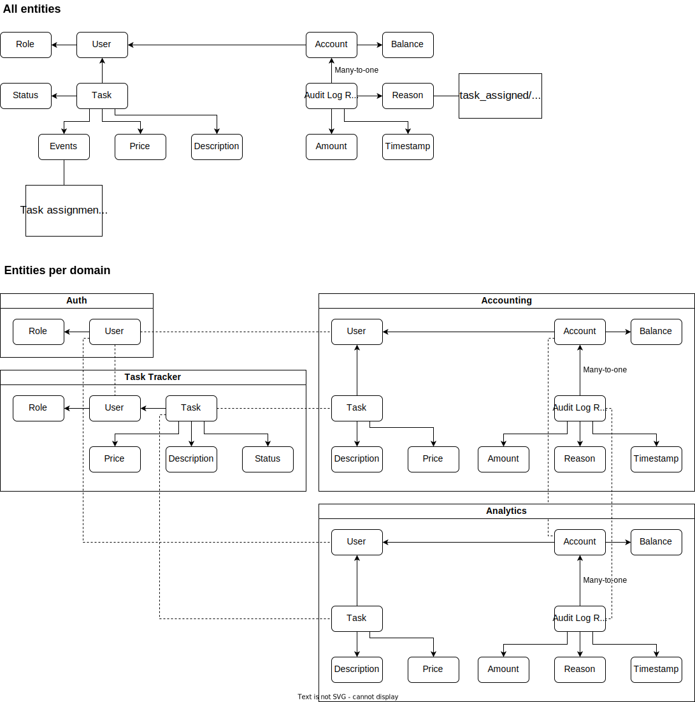

# Awesome Task Exchange System

## Event Storming

## Data Model

## Services

* Auth - User authentication and management;
* Task Tracker;
* Accounting;
* Analytics.

## Service Communications

## Kafka Topic Naming Convention

Business topics are named after the root entities of the business events
(e.g. `tasks`).
Streaming topics are named after the streamed entities with addition of
`-stream` suffix (e.g. `tasks-stream`).
